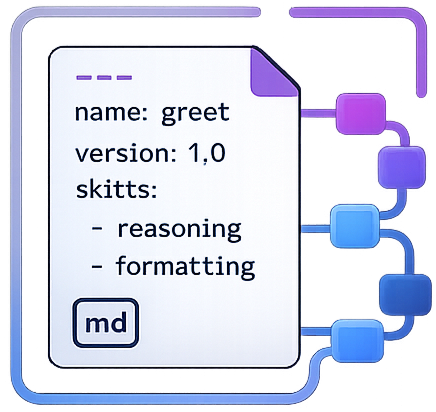

<p align="center">
  
</p>

# PromptFrame

> LLM-agnostic prompt management — YAML storage, typed loading, structured output support, composable builder API, markdown skills, and a full CLI.


[](https://pypi.org/project/promptframe/) [](https://pypi.org/project/promptframe/) [](https://pypi.org/project/promptframe/) [](./LICENSE)

---

## Features

- **Typed YAML prompt loading** — store prompts as structured YAML files and load them as typed Python objects with attribute access
- **Environment-aware registry** — resolve prompts across layered `dev / staging / prod / common` directories
- **Structured output schema** — extend `LLMBaseModel` to auto-generate input/output JSON schema instructions for any LLM
- **Per-field YAML instructions** — decouple LLM field instructions from Pydantic models via `model_attribute_id`
- **Fluent builder API** — compose prompts from reusable components using `>>` or `|` operators
- **Markdown skill files** — inject rich `SKILL.md` instruction documents into prompts as reusable context
- **Robust JSON parsing** — parse LLM responses including partial JSON and markdown-fenced blocks
- **Full CLI** — scaffold, inspect, validate, lint, render, diff, and export prompt and skill files

---

## Installation

```bash
pip install promptframe
```

---

## Quick Start

### 1. Loading and using prompts

```python
from promptframe import PromptRegistry

reg = PromptRegistry(base="prompts/", environment="prod", common="shared")

# Load a prompt YAML file
prompts = reg.load_prompt("my_prompts")

# Attribute or dict access
text = prompts.summarize_text.format(text="The quick brown fox...")
text = prompts.prompt_dict["summarize_text"].prompt
```

### 2. Assembling prompts with the builder

```python
from promptframe import StructuredPromptBuilder
from promptframe.components import SimplePromptComponent, PromptSectionComponent, InputComponent

prompt = (
    StructuredPromptBuilder()
    >> SimplePromptComponent("You are a helpful assistant.")
    >> PromptSectionComponent(["Be concise", "Avoid jargon"], header="Rules:")
    >> InputComponent()
).build({"input": "What is 2+2?"})
```

### 3. Structured output with LLMBaseModel

```python
from pydantic import Field
from promptframe import LLMBaseModel
from promptframe.fields import LLMField

class CustomerOutput(LLMBaseModel):
    name: str = LLMField(..., description="Customer full name", model_attribute_id="customer_name")
    score: int = Field(..., description="Risk score 0-100")

# Plain schema instructions
instructions = CustomerOutput.get_format_instructions()

# With per-field YAML instructions injected
mp = reg.load_model_prompt("field_prompts")
instructions = CustomerOutput.get_format_instructions_with_prompt(
    prompt_model_dict=mp.prompt_model_dict
)
```

### 4. Using skills

```python
from promptframe import SkillRegistry, StructuredPromptBuilder
from promptframe.components import SimplePromptComponent, SkillComponent

registry = SkillRegistry("skills/")
skill = registry.get("frontend-design")

prompt = (
    StructuredPromptBuilder()
    >> SimplePromptComponent("You are a frontend expert.")
    >> SkillComponent(skill, sections=["Guidelines"])
    >> SimplePromptComponent("Task: {task}")
).build({"task": "Build a login page"})
```

### 5. Parsing LLM responses

```python
from promptframe.parsers import json_parser

result = json_parser(llm_response)          # plain JSON or markdown-fenced
result = json_parser('```json\n{...}\n```') # fenced block
```

---

## YAML File Formats

### `type: prompt`

```yaml
version: 1.0

metadata:
  type: prompt
  name: my_prompts
  description: General prompt collection
  tags: [nlp, summarization]
  project: my_project

prompts:
  - pid: summarize_text
    description: Summarize a block of text.
    input_variables:
      - text
    prompt: |
      Summarize the following text:
      {text}
```

### `type: model_prompt`

Bind per-field LLM instructions to model attributes via `model_attribute_id`:

```yaml
version: 1.0

metadata:
  type: model_prompt
  name: field_prompts
  description: Per-field LLM instructions

prompts:
  - pid: clean_name
    description: Clean and normalize a name field.
    model_attribute_id: customer_name
    input_instruction: |
      The input contains {raw_name}.
    output_instruction: |
      Return a cleaned human-readable name.
```

### Skill file (`.md` with YAML frontmatter)

```markdown
---
name: frontend-design
description: When to use this skill.
tags: [frontend, react, css]
version: "1.0"
---

## Guidelines

- Use semantic HTML
- Prefer CSS variables for theming

## Examples

Provide examples here.
```

---

## Project Layout

The recommended directory structure for a `promptframe` project:

```
prompts/
├── common/          # shared prompts across all environments
├── dev/
├── staging/
└── prod/            # environment-specific overrides

skills/
├── frontend-design/
│   └── SKILL.md
└── data-analysis/
    └── SKILL.md
```

Scaffold this structure with the CLI:

```bash
promptframe scaffold prompts/ --example
```

---

## Prompt Components

| Component | Description |
|---|---|
| `SimplePromptComponent` | Wraps a plain string or `Prompt` object with `{placeholder}` support |
| `PromptSectionComponent` | Renders a header + body (single string or bullet list) |
| `InputComponent` | Labelled input block (e.g. `<input>{input}</input>`) |
| `TemplatePromptComponent` | Composes multiple components via a format template |
| `SequentialPromptComponent` | Joins components in order; created via `\|` operator |
| `ConditionalPromptComponent` | Renders a component only when a context key is truthy |
| `SkillComponent` | Injects a markdown `Skill` document into the prompt |

---

## CLI Reference

```
promptframe --help
```

| Command | Description |
|---|---|
| `promptframe init <template> <output>` | Create a `regular` or `model` prompt YAML template |
| `promptframe list [path]` | List all prompt files in a directory |
| `promptframe validate <path>` | Validate YAML prompt files for required fields |
| `promptframe inspect <file>` | Inspect a prompt file's metadata and prompts |
| `promptframe render <file> <pid>` | Render a single prompt by its `pid` |
| `promptframe lint <path>` | Lint prompt files for best-practice issues |
| `promptframe export <file>` | Export a prompt file to JSON |
| `promptframe diff <old> <new>` | Diff two prompt YAML files |
| `promptframe scaffold [path]` | Scaffold a dev/staging/prod/common directory structure |
| `promptframe skill init <name>` | Create a new skill file |
| `promptframe skill list [path]` | List all skills |
| `promptframe skill inspect <key>` | Inspect a skill's metadata and sections |
| `promptframe skill render <key>` | Render a skill (with optional section filtering) |
| `promptframe skill validate [path]` | Validate skill files |
| `promptframe skill lint [path]` | Lint skill files |
| `promptframe skill diff <old> <new>` | Diff two skill files |
| `promptframe skill search <query>` | Search skills by keyword |

---

## API Documentation

Full API reference is available in the [`docs/`](./docs/) folder:

- [Overview & Quick Start](./docs/index.md)
- [Models](./docs/models.md)
- [PromptRegistry](./docs/registry.md)
- [LLMBaseModel](./docs/llm_base_model.md)
- [Prompt Components](./docs/components.md)
- [StructuredPromptBuilder](./docs/builder.md)
- [Skills](./docs/skills.md)
- [LLMField](./docs/fields.md)
- [Parsers](./docs/parsers.md)
- [Exceptions](./docs/exceptions.md)
- [CLI](./docs/cli.md)

---

## Status

`0.2.2` — active development. API is stabilising. Watch this repo for the first stable release.
